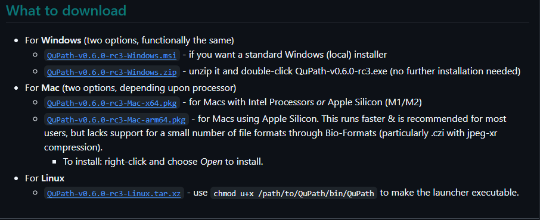
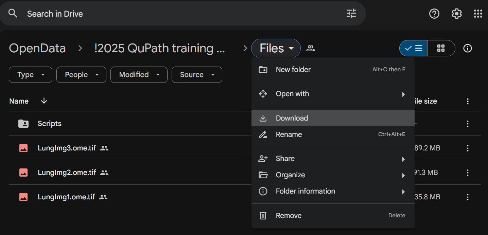

# QuPathNotebooks
Jupyter notebooks for teaching QuPath - Feb 2025, QuPath v0.6.0rc3 
Hosted by [The Microscopy and Histology Core Facilities at La Jolla Institute](https://www.lji.org/research/research-services/microscopy-histology/) 
Sara McArdle 
Zbigniew Mikulski 
Assisted by  
Michael Nelson of [LOCI](https://loci.wisc.edu/)
## Join Slack! 

## Prepare for the workshop

### Introductory video
Please watch this short video which introduces some QuPath concepts and has some information on installation issues. 
 

### Version of QuPath we will be using: 0.6.0RC3
Make sure to install this ahead of time, as some companies/institutes/hospitals **require administrator access** to download and set up QuPath. 
[Get it here!](https://github.com/qupath/qupath/releases) 
 

### Download your images ahead of time!
[Download the files from Google Drive](https://drive.google.com/drive/u/1/folders/1t5DtJriZdPpNpuVJBMACkN3Ra16QUjKu) 
 
See steps 1 and 2 in Session 1 to create your first project! TODO ADD LINK  

### If you have time, watch this excellent introduction by the author of QuPath!
 
Or skip directly to [the part discussing QuPath](https://youtu.be/HHo2BIacq8w?t=1835)!

# See you there and online!

## Additional resources

### Ask questions
https://forum.image.sc/tag/qupath 

### QuPath documentation for 0.5, the latest stable release 
Main docs - https://qupath.readthedocs.io/en/0.5/  
Scripting Javadocs - https://qupath.github.io/javadoc/docs/ 

### Introduction to QuPath scripting (unofficial)
https://www.imagescientist.com/image-analysis 

### Useful plugins and associated software
#### Segmentation 
https://github.com/qupath/qupath-extension-stardist 
https://github.com/BIOP/qupath-extension-cellpose 
https://github.com/qupath/qupath-extension-instanseg 
#### Aligning images 
https://github.com/qupath/qupath-extension-align 
https://imagej.net/plugins/bdv/warpy/warpy-image-combiner 
#### Python access 
https://github.com/Bayer-Group/paquo 

### Interesting reading - imaging and analysis
Start Here 
[Introduction to Bioimage Analysis](https://bioimagebook.github.io/index.html) 
[Workflows and Components of Bioimage Analysis](https://link.springer.com/chapter/10.1007/978-3-030-22386-1_1) 
[A biologist’s guide to planning and performing quantitative bioimaging experiments](https://pmc.ncbi.nlm.nih.gov/articles/PMC10298797/) 

General 
[Creating and troubleshooting microscopy analysis workflows: Common challenges and common solutions](https://onlinelibrary.wiley.com/doi/10.1111/jmi.13288) 
[Developing open-source software for bioimage analysis: opportunities and challenges](https://pmc.ncbi.nlm.nih.gov/articles/PMC8226416/)
[Open-source deep-learning software for bioimage segmentation](https://pmc.ncbi.nlm.nih.gov/articles/PMC8108523/) 
[The QuPath community](https://analyticalscience.wiley.com/content/article-do/qupath-community) 

Do good things, not bad things! 
[Avoiding a replication crisis in deep-learning-based bioimage analysis](https://pubmed.ncbi.nlm.nih.gov/34608322/) 
[Avoiding Twisted Pixels: Ethical Guidelines for the Appropriate Use and Manipulation of Scientific Digital Images](https://pmc.ncbi.nlm.nih.gov/articles/PMC4114110/) 
[Imaging methods are vastly underreported in biomedical research](https://pmc.ncbi.nlm.nih.gov/articles/PMC7434332/) 
[Reproducibility standards for machine learning in the life sciences](https://pmc.ncbi.nlm.nih.gov/articles/PMC9131851/) 

# Acknowledgements
[La Jolla Institute](https://www.lji.org/about-us/)
Core facility staff
IT
Coordinaters
CZI funding
[Research group of Pete Bankhead](https://institute-genetics-cancer.ed.ac.uk/research/research-groups-a-z/peter-bankhead-research-group)
