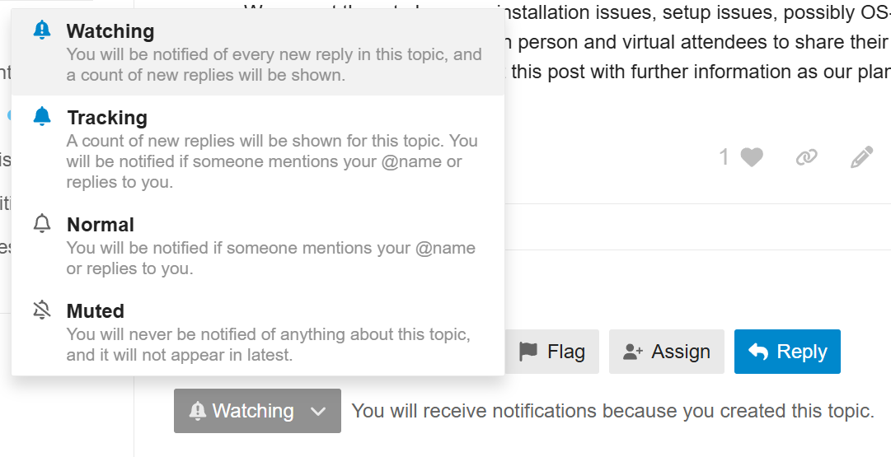
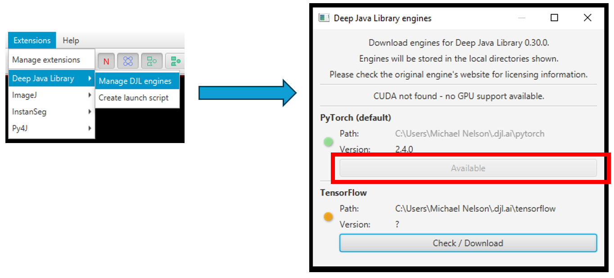
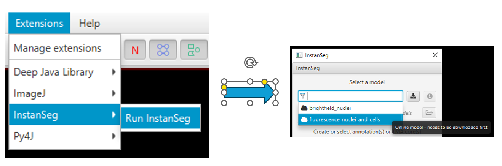

# From Samples to Knowledge 2025 Repo
Jupyter notebooks for teaching QuPath - Feb 2025, QuPath v0.6.0rc3 
Hosted by [The Microscopy and Histology Core Facilities at La Jolla Institute](https://www.lji.org/research/research-services/microscopy-histology/) 
Sara McArdle 
Zbigniew Mikulski 
and
Michael Nelson of [LOCI](https://loci.wisc.edu/)

## Ask questions in the image.sc forum thread!
We ask that the majority of questions be directed to the [image.sc forum thread here](https://forum.image.sc/t/question-thread-from-samples-to-knowledge-2025/108739), where it will be easiest for all of the hosts to respond to questions and issues as they have time. 
If you are interested in keeping up with the topic, make sure to create an image.sc forum profile, and set the post to "Watching" - which will send a notification email whenever there is a new post.  

## Prepare for the workshop

### Introductory video
Please watch this short video which introduces some QuPath concepts and has some information on installation issues. 
 

### Install QuPath: we will be using: 0.6.0RC3
Make sure to install QuPath **ahead of time**, as some companies/institutes/hospitals **require administrator access** to download and set up QuPath. 
[Get it here!](https://github.com/qupath/qupath/releases) 
 

### Download your data and scripts!
If you wait until you arrive, you will be competing with everyone else for bandwidth! 
[Download the files from Google Drive](https://drive.google.com/drive/u/1/folders/1t5DtJriZdPpNpuVJBMACkN3Ra16QUjKu) 
 
See steps 1 and 2 in Session 1 to create your first project! 

### Download the Warpy extension and InstanSeg models
Install [the Warpy extension](https://github.com/BIOP/qupath-extension-warpy) into your copy of QuPath 0.6.0 
[Warpy download here](https://github.com/biop/qupath-extension-warpy/releases) 
There will be a number of .jar files - drag them into an open QuPath window to install, or create an Extensions folder in QuPath's *Preferences* <kbd>Edit > Preferences > Extensions</kbd> and place them in that folder.   
Instructions for InstanSeg setup can be found by scrolling down to [Method 2- One Time Setup, here.](https://github.com/saramcardle/FS2K/blob/main/Session%204-%20Cell%20Detection.ipynb) 
  
 

### If you have time, watch this excellent introduction by the author of QuPath!
 
Or skip directly to [the part of the video discussing QuPath](https://youtu.be/HHo2BIacq8w?t=1835)!

# See you there and online!

## Additional resources

### Ask questions (the devs check here)
https://forum.image.sc/tag/qupath 

### QuPath documentation for 0.5, the latest stable release 
Main docs - https://qupath.readthedocs.io/en/0.5/  
Scripting Javadocs - https://qupath.github.io/javadoc/docs/ 

### Introduction to QuPath scripting (unofficial)
https://www.imagescientist.com/image-analysis 

### Useful plugins and associated software
#### Segmentation 
https://github.com/qupath/qupath-extension-stardist 
https://github.com/BIOP/qupath-extension-cellpose 
https://github.com/qupath/qupath-extension-instanseg 
#### Aligning images 
https://github.com/qupath/qupath-extension-align 
https://imagej.net/plugins/bdv/warpy/warpy-image-combiner 
#### Python access 
https://github.com/Bayer-Group/paquo 

### Interesting reading - imaging and analysis
Start Here 
[!!!Introduction to Bioimage Analysis!!!](https://bioimagebook.github.io/index.html) 
[Workflows and Components of Bioimage Analysis](https://link.springer.com/chapter/10.1007/978-3-030-22386-1_1) 
[A biologist’s guide to planning and performing quantitative bioimaging experiments](https://pmc.ncbi.nlm.nih.gov/articles/PMC10298797/) 

General 
:heavy_dollar_sign:[Multiplex protein imaging in tumor biology - review](https://www.nature.com/articles/s41568-023-00657-4) 
[Creating and troubleshooting microscopy analysis workflows: Common challenges and common solutions](https://onlinelibrary.wiley.com/doi/10.1111/jmi.13288) 
[Developing open-source software for bioimage analysis: opportunities and challenges](https://pmc.ncbi.nlm.nih.gov/articles/PMC8226416/)
[Open-source deep-learning software for bioimage segmentation](https://pmc.ncbi.nlm.nih.gov/articles/PMC8108523/) 
[The QuPath community](https://analyticalscience.wiley.com/content/article-do/qupath-community) 

Do good things, not bad things! 
[Avoiding a replication crisis in deep-learning-based bioimage analysis](https://pubmed.ncbi.nlm.nih.gov/34608322/) 
[Avoiding Twisted Pixels: Ethical Guidelines for the Appropriate Use and Manipulation of Scientific Digital Images](https://pmc.ncbi.nlm.nih.gov/articles/PMC4114110/) 
[Imaging methods are vastly underreported in biomedical research](https://pmc.ncbi.nlm.nih.gov/articles/PMC7434332/) 
[Reproducibility standards for machine learning in the life sciences](https://pmc.ncbi.nlm.nih.gov/articles/PMC9131851/) 

# Acknowledgements
Staff from the [La Jolla Institute](https://www.lji.org/about-us/), including  
Lisa Bouker, Admin Assistant Extrordinaire! 
IT 
Facilities  
 
Funding: Chan Zuckerberg Iniatiative Imaging Scientist grant 
 
[Research group of Pete Bankhead](https://institute-genetics-cancer.ed.ac.uk/research/research-groups-a-z/peter-bankhead-research-group)
